# AI交易系统 (NOFX) - AI上下文初始化

## 项目愿景

NOFX是一个**通用智能交易操作系统**，构建在统一架构之上。我们已在加密货币市场成功闭环：**"多智能体决策 → 统一风险控制 → 低延迟执行 → 实盘/模拟账户回测"**，正将此技术栈扩展至**股票、期货、期权、外汇及所有金融市场**。

### 核心特性

- **通用数据与回测层**：跨市场、跨时间框架、跨交易所的统一表示和因子库，积累可迁移的"策略记忆"
- **多智能体自我博弈与自我进化**：策略自动竞争并选择最优，基于账户级盈亏和风险约束持续迭代
- **集成执行与风险控制**：低延迟路由、滑点/风险控制沙盒、账户级限制、一键切换市场

## 项目架构总览

### 技术栈
- **后端**：Go + Gin框架 + SQLite数据库
- **前端**：React 18 + TypeScript + Vite + TailwindCSS
- **多交易所支持**：Binance、Hyperliquid、Aster DEX
- **AI集成**：DeepSeek、Qwen及自定义OpenAI兼容API
- **状态管理**：前端Zustand，后端数据库驱动
- **实时更新**：SWR + 5-10秒轮询间隔

### 架构特点
- 🗄️ 数据库驱动配置（无需JSON编辑）
- 🔐 JWT认证 + 可选2FA支持
- 📊 实时性能跟踪与分析
- 🤖 多AI竞争模式 + 实时对比
- 🔌 RESTful API完整配置和监控

## 模块结构图

```mermaid
graph TD
    A["(根) AI交易系统"] --> B["core"]
    A --> C["trader"]
    A --> D["market"]
    A --> E["decision"]
    A --> F["api"]
    A --> G["config"]
    A --> H["web"]
    A --> I["manager"]
    A --> J["logger"]
    A --> K["crypto"]
    A --> L["pool"]

    B --> B1["bootstrap"]
    B --> B2["hook"]
    B --> B3["mcp"]

    C --> C1["auto_trader.go"]
    C --> C2["interface.go"]
    C --> C3["binance_futures.go"]
    C --> C4["hyperliquid_trader.go"]
    C --> C5["aster_trader.go"]

    D --> D1["data.go"]
    D --> D2["websocket_client.go"]
    D --> D3["api_client.go"]
    D --> D4["monitor.go"]
    D --> D5["types.go"]

    E --> E1["engine.go"]
    E --> E2["prompt_manager.go"]
    E --> E3["validate_test.go"]

    F --> F1["server.go"]
    F --> F2["utils.go"]
    F --> F3["crypto_handler.go"]

    G --> G1["database.go"]
    G --> G2["config.go"]

    H --> H1["src/App.tsx"]
    H --> H2["src/components/"]
    H --> H3["src/pages/"]
    H --> H4["src/lib/"]

    I --> I1["trader_manager.go"]

    J --> J1["decision_logger.go"]
    J --> J2["telegram_sender.go"]

    K --> K1["encryption.go"]
    K --> K2["crypto.go"]

    L --> L1["coin_pool.go"]

    click C1 "./trader/CLAUDE.md" "查看 trader 模块文档"
    click C2 "./trader/CLAUDE.md" "查看 trader 模块文档"
    click D1 "./market/CLAUDE.md" "查看 market 模块文档"
    click E1 "./decision/CLAUDE.md" "查看 decision 模块文档"
    click F1 "./api/CLAUDE.md" "查看 api 模块文档"
    click G1 "./config/CLAUDE.md" "查看 config 模块文档"
    click H1 "./web/CLAUDE.md" "查看 web 模块文档"
```



## 模块索引

| 模块 | 路径 | 语言 | 职责描述 | 状态 |
|------|------|------|----------|------|
| **trader** | `/trader/` | Go | 交易执行引擎，支持多交易所 | ✅ 已扫描 |
| **market** | `/market/` | Go | 市场数据获取与技术分析 | ✅ 已扫描 |
| **decision** | `/decision/` | Go | AI决策引擎与提示词管理 | ✅ 已扫描 |
| **api** | `/api/` | Go | RESTful API服务器 | ✅ 已扫描 |
| **config** | `/config/` | Go | 数据库配置与数据模型 | ✅ 已扫描 |
| **web** | `/web/` | TS/React | 前端用户界面 | ✅ 已扫描 |
| **manager** | `/manager/` | Go | 交易员管理器 | 📋 待扫描 |
| **logger** | `/logger/` | Go | 决策日志记录与Telegram通知 | 📋 待扫描 |
| **crypto** | `/crypto/` | Go | 加密服务与数据安全 | 📋 待扫描 |
| **bootstrap** | `/bootstrap/` | Go | 系统启动与初始化钩子 | 📋 待扫描 |
| **pool** | `/pool/` | Go | 币种池与信号源管理 | 📋 待扫描 |

## 运行与开发

### 环境要求
- **Go 1.21+**
- **Node.js 18+**
- **TA-Lib**库（技术指标计算）

### 快速启动
1. **Docker部署（推荐）**：
   ```bash
   cp config.json.example config.json
   ./start.sh start --build
   ```

2. **手动部署**：
   ```bash
   # 后端
   go mod download
   go build -o nofx
   ./nofx

   # 前端（新终端）
   cd web
   npm install
   npm run dev
   ```

### 访问地址
- **Web界面**: http://localhost:3000
- **API服务器**: http://localhost:8080

## 测试策略

### 单元测试
```bash
# Go后端测试
go test ./...

# 前端测试
cd web
npm test
```

### 集成测试
- 交易所连接测试
- AI决策流程测试
- 风险控制机制测试

### 性能测试
- API响应时间测试
- 并发交易处理测试
- 数据库性能基准测试

## 编码规范

### Go代码规范
- 遵循Go官方代码规范
- 使用gofmt格式化代码
- 错误处理必须显式处理
- 包级别文档注释

### TypeScript代码规范
- 使用ESLint + Prettier
- 严格的TypeScript类型检查
- React函数组件 + Hooks模式
- 遵循Airbnb编码规范

### 数据库规范
- 使用WAL模式提升并发性能
- 敏感数据必须加密存储
- 事务处理保证数据一致性

## AI使用指引

### 项目架构理解
- 这是一个**AI驱动的自动交易系统**，核心是AI决策引擎
- 系统支持**多交易所**（Binance、Hyperliquid、Aster DEX）
- 采用**多智能体竞争**模式，不同AI模型可以同时交易竞争

### 关键模块说明
1. **decision模块**：AI决策核心，负责市场分析和交易决策
2. **trader模块**：交易执行层，对接不同交易所API
3. **market模块**：市场数据获取和技术指标计算
4. **api模块**：RESTful API，提供配置和监控接口
5. **config模块**：数据库配置，支持多用户和加密存储

### 开发重点
- 理解AI决策流程和提示词工程
- 关注风险控制和资金安全
- 熟悉不同交易所的API差异
- 重视系统稳定性和错误处理

## 变更记录 (Changelog)

### 2025-11-15 06:49:04 - 初始化完成
- ✅ 完成项目架构扫描和模块识别
- ✅ 生成根级CLAUDE.md和模块结构图
- ✅ 分析核心技术栈和关键模块
- 📋 待完成：各模块级详细文档生成

---

**扫描统计**：
- 总文件数：约200+个文件
- 已扫描核心模块：6个
- 主要语言：Go (后端) + TypeScript (前端)
- 架构模式：微服务 + 数据库驱动

**下一步建议**：
1. 完成剩余模块的详细扫描
2. 为每个模块生成CLAUDE.md文档
3. 添加导航面包屑到模块文档
4. 更新覆盖率统计