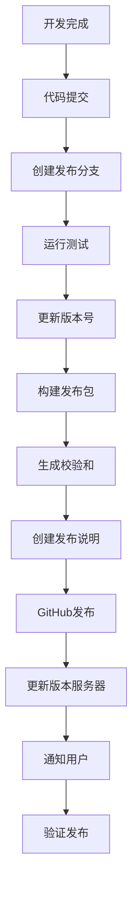

# 🚀 AI交易系统版本发布指南

## 📋 目录

- [版本发布流程](#版本发布流程)
- [发布前准备](#发布前准备)
- [版本号管理](#版本号管理)
- [自动发布脚本](#自动发布脚本)
- [手动发布步骤](#手动发布步骤)
- [GitHub发布](#github发布)
- [版本更新服务器](#版本更新服务器)
- [发布验证](#发布验证)
- [故障排除](#故障排除)

## 🔄 版本发布流程



## 📦 发布前准备

### 1. 代码检查清单

- [ ] **代码质量检查**
  - 代码审查完成
  - 单元测试通过
  - 集成测试通过
  - 代码风格检查通过

- [ ] **功能验证**
  - 新功能正常工作
  - 回归测试通过
  - 性能测试达标
  - 安全检查通过

- [ ] **文档更新**
  - README.md更新
  - CHANGELOG.md更新
  - API文档更新
  - 安装指南更新

### 2. 环境准备

```bash
# 确保工作目录干净
git status
git pull origin main

# 安装发布工具依赖
npm install -g gh  # GitHub CLI (可选)
```

## 🏷️ 版本号管理

### 版本号格式

我们遵循语义化版本控制 (SemVer)：
```
MAJOR.MINOR.PATCH[-PRERELEASE][+BUILD]
```

示例：
- `1.0.0` - 主要版本
- `1.1.0` - 次版本
- `1.1.1` - 补丁版本
- `1.2.0-alpha.1` - 预发布版本

### 版本类型说明

| 类型 | 触发条件 | 示例 |
|------|----------|------|
| **Major** | 破坏性变更，不兼容API | 1.0.0 → 2.0.0 |
| **Minor** | 新功能，向后兼容 | 1.0.0 → 1.1.0 |
| **Patch** | Bug修复，向后兼容 | 1.0.0 → 1.0.1 |
| **Pre** | 预发布版本 | 1.1.0-alpha.1 |

### 版本文件

项目中的版本信息存储在：
- `version.txt` - 当前版本号
- `web/package.json` - 前端版本
- `go.mod` - Go模块版本

## 🤖 自动发布脚本

### 使用发布脚本

#### Linux/macOS
```bash
# 给脚本执行权限
chmod +x scripts/release.sh

# 发布补丁版本
./scripts/release.sh -t patch

# 发布次版本
./scripts/release.sh -t minor

# 发布指定版本
./scripts/release.sh 1.2.0

# 预演发布（不执行实际操作）
./scripts/release.sh -t minor --dry-run

# 跳过测试快速发布
./scripts/release.sh 1.2.1 -s

# 仅构建Windows版本
./scripts/release.sh -t minor -p windows
```

#### Windows
```cmd
# 发布补丁版本
scripts\release.bat -t patch

# 发布次版本
scripts\release.bat -t minor

# 发布指定版本
scripts\release.bat 1.2.0

# 预演发布
scripts\release.bat -t minor --dry-run

# 跳过测试
scripts\release.bat 1.2.1 -s

# 仅构建Windows版本
scripts\release.bat -t minor -p windows
```

### 发布脚本参数

| 参数 | 说明 | 示例 |
|------|------|------|
| `-h, --help` | 显示帮助信息 | `-h` |
| `-t, --type` | 版本类型 | `-t minor` |
| `-b, --build` | 构建类型 | `-b debug` |
| `-p, --platform` | 目标平台 | `-p windows` |
| `-s, --skip-tests` | 跳过测试 | `-s` |
| `-d, --dry-run` | 预演模式 | `--dry-run` |
| `--no-git` | 跳过Git操作 | `--no-git` |
| `--no-github` | 跳过GitHub发布 | `--no-github` |

## 🔧 手动发布步骤

### 步骤1：更新版本号

```bash
# 更新版本文件
echo "1.2.0" > version.txt

# 更新前端版本
cd web
npm version 1.2.0 --no-git-tag-version
cd ..
```

### 步骤2：提交代码

```bash
git add .
git commit -m "release: version 1.2.0"
git push origin main
```

### 步骤3：构建应用

```bash
# 构建后端
go build -ldflags "-X main.AppVersion=1.2.0 -X main.BuildTime=$(date -u '+%Y-%m-%d_%H:%M:%S')" -o nofx .

# 构建前端
cd web
npm ci
npm run build
cd ..
```

### 步骤4：创建发布包

```bash
# 创建发布目录
mkdir -p releases/v1.2.0

# 复制文件
cp nofx releases/v1.2.0/
cp -r web/dist releases/v1.2.0/web
cp README.md CHANGELOG.md config.json.example releases/v1.2.0/

# 生成校验和
cd releases/v1.2.0
sha256sum * > checksums.txt
cd ../..
```

### 步骤5：创建Git标签

```bash
git tag -a "v1.2.0" -m "Release version 1.2.0"
git push origin "v1.2.0"
```

## 🐙 GitHub发布

### 自动GitHub发布

使用发布脚本自动创建GitHub发布：

```bash
# 确保已安装GitHub CLI
gh --version

# 自动发布（推荐）
./scripts/release.sh -t minor
```

### 手动GitHub发布

1. 访问GitHub仓库
2. 点击 "Releases" → "Create a new release"
3. 选择或创建标签（如 `v1.2.0`）
4. 填写发布标题和说明
5. 上传构建文件
6. 点击 "Publish release"

### 发布说明模板

```markdown
## 🚀 Release v1.2.0

### ✨ 新增功能
- 新增版本控制和自动更新系统
- 优化用户界面响应速度
- 增强安全性验证机制

### 🐛 问题修复
- 修复内存泄漏问题
- 解决API调用超时
- 修复前端兼容性问题

### 🔧 改进
- 优化数据库查询性能
- 改进错误处理逻辑
- 更新依赖库版本

### 📦 安装说明

#### Windows
```bash
# 下载并解压
nofx-v1.2.0-windows.zip

# 运行安装脚本
install.bat

# 启动应用
nofx.exe
```

#### Linux/macOS
```bash
# 下载并解压
wget https://github.com/your-org/nofx/releases/download/v1.2.0/nofx-v1.2.0-linux.tar.gz
tar -xzf nofx-v1.2.0-linux.tar.gz

# 运行安装脚本
./install.sh

# 启动应用
./nofx
```

### 🔐 校验和
所有文件的校验和可在 `checksums.txt` 中找到。

### 📖 文档
- [安装指南](https://docs.nofx.com/installation)
- [升级指南](https://docs.nofx.com/upgrade)
- [API文档](https://docs.nofx.com/api)

---

感谢您的支持！如有问题请提交Issue。
```

## 🌐 版本更新服务器

### 更新版本信息

系统支持多种版本服务器配置：

#### 1. GitHub Releases（推荐）
```json
{
  "version_server_url": "https://api.github.com/repos/your-org/nofx/releases/latest",
  "fallback_version": "1.0.0"
}
```

#### 2. 自建版本服务器
```json
{
  "version_server_url": "https://updates.nofx.com/api/v1/latest",
  "api_key": "your-api-key"
}
```

#### 3. 本地版本配置
```json
{
  "version_server_url": "file:///path/to/version.json",
  "local_versions": ["1.0.0", "1.1.0", "1.2.0"]
}
```

### 版本信息格式

```json
{
  "version": "1.2.0",
  "build_time": "2025-11-15 06:49:04",
  "release_date": "2025-11-15",
  "release_notes": "版本1.2.0发布内容...",
  "download_url": "https://github.com/your-org/nofx/releases/download/v1.2.0/nofx-v1.2.0-windows.zip",
  "checksum": "sha256:abc123...",
  "update_size": 52428800,
  "is_critical": false,
  "min_version": "1.0.0",
  "platform": "windows-amd64",
  "update_type": "full",
  "force_update": false,
  "published_at": "2025-11-15T06:49:04Z"
}
```

## ✅ 发布验证

### 1. 本地测试

```bash
# 测试新版本
./scripts/test_version_system.sh

# 检查版本更新功能
curl http://localhost:8080/api/version/check
```

### 2. 清洁安装测试

```bash
# 清理环境
./stop.sh
rm -rf data/ logs/

# 安装新版本
./deploy.sh

# 验证功能
curl http://localhost:8080/api/version/current
```

### 3. 升级测试

```bash
# 从旧版本升级
# 安装旧版本 → 运行更新脚本 → 验证升级成功
```

### 4. 完整性验证

- [ ] 所有功能正常工作
- [ ] 版本更新流程正常
- [ ] 数据迁移无问题
- [ ] 性能符合要求
- [ ] 安全检查通过

## 🔔 版本通知

### 自动通知配置

#### 邮件通知
```json
{
  "notification": {
    "email": {
      "enabled": true,
      "recipients": ["admin@company.com", "users@company.com"],
      "smtp_server": "smtp.company.com",
      "template": "release_notification.html"
    }
  }
}
```

#### Slack通知
```json
{
  "notification": {
    "slack": {
      "enabled": true,
      "webhook": "https://hooks.slack.com/services/YOUR/SLACK/WEBHOOK",
      "channel": "#releases"
    }
  }
}
```

#### 企业微信通知
```json
{
  "notification": {
    "wechat": {
      "enabled": true,
      "webhook": "https://qyapi.weixin.qq.com/cgi-bin/webhook/send?key=YOUR_KEY"
    }
  }
}
```

## 🐛 故障排除

### 常见发布问题

#### 1. 版本号冲突
**问题**: Git标签已存在
**解决**:
```bash
# 删除本地标签
git tag -d v1.2.0

# 删除远程标签
git push origin :refs/tags/v1.2.0

# 重新创建标签
git tag -a "v1.2.0" -m "Release version 1.2.0"
git push origin "v1.2.0"
```

#### 2. 构建失败
**问题**: Go编译或前端构建失败
**解决**:
```bash
# 清理缓存
go clean -cache
cd web && rm -rf node_modules package-lock.json && npm install

# 检查依赖版本
go mod tidy
npm audit fix
```

#### 3. 校验和不匹配
**问题**: 下载文件的校验和不匹配
**解决**:
```bash
# 重新生成校验和
cd releases/v1.2.0
sha256sum * > checksums.txt

# 重新上传文件
```

#### 4. GitHub发布失败
**问题**: GitHub CLI认证失败
**解决**:
```bash
# 重新认证
gh auth login

# 检查权限
gh auth status
```

### 调试模式

使用预演模式检查发布流程：
```bash
./scripts/release.sh -t minor --dry-run
```

## 📈 发布最佳实践

### 1. 版本规划
- 定期发布周期（如每两周一个次版本）
- 明确发布时间表
- 提前准备发布说明

### 2. 质量保证
- 完整的测试覆盖
- 代码审查流程
- 自动化CI/CD

### 3. 发布流程
- 使用发布脚本自动化
- 多环境验证
- 回滚方案准备

### 4. 用户沟通
- 提前发布通知
- 详细的升级说明
- 技术支持准备

### 5. 监控和反馈
- 发布后监控
- 用户反馈收集
- 问题快速响应

## 📞 技术支持

如需发布支持，请联系：
- 📧 邮箱: release@nofx.com
- 🐛 问题反馈: GitHub Issues
- 💬 实时支持: Slack/Discord

---

**注意**: 首次发布建议在有经验的开发人员指导下进行，确保流程正确性。